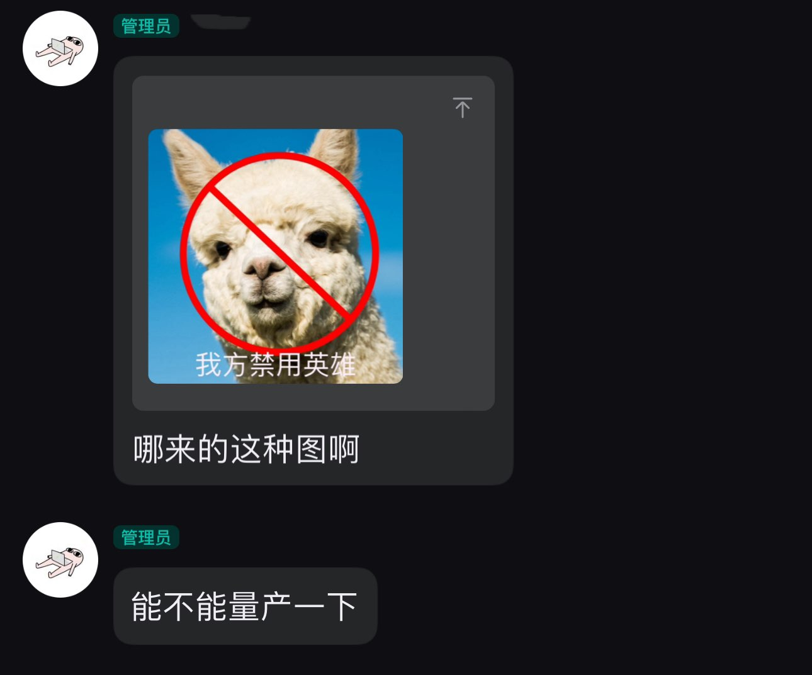
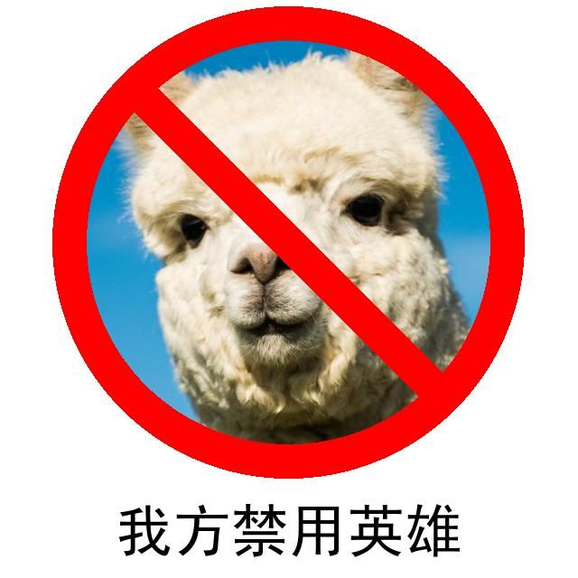

## 需求来源



## 描述

大部分图片处理代码`ban.py`使用Gemini-2.5-pro生成

## 使用方法

+ 安装依赖库`Pillow`

```
pip install Pillow
```

+ 将待处理的图片放入`input_images`

+ 运行

```
python ban.py
```

+ 处理后的图片在`final_images`

## 效果展示


