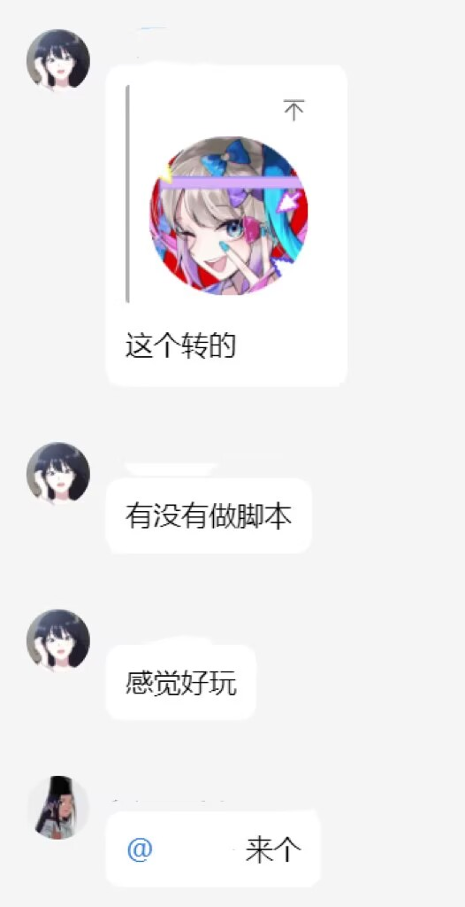

## 需求来源




## 描述

大部分图片处理代码`ban.py`，`make_avatar_gif.py`使用Gemini-2.5-pro生成

战队成员头像图片来源：Cabelis在2025TSCTF-J AI方向题目`MustBeBot`所使用的图片

## 使用方法

### 禁用英雄

+ 安装依赖库`Pillow`

```
pip install Pillow
```

+ 将待处理的图片放入`input_images`

+ 运行

```
python ban.py
```

+ 处理后的图片在`final_images`

### 旋转头像

+ 在https://www.gyan.dev/ffmpeg/builds/ 安装 [ffmpeg-7.1.1-essentials_build](https://www.gyan.dev/ffmpeg/builds/packages/ffmpeg-7.1.1-essentials_build.7z)，并将解压后文件夹的bin路径添加到环境变量
+ 待处理的图片放入`input_images`
+ 运行

```python
python make_avatar_gif.py
```

+ 处理后的图片在`final_gifs`

## 效果展示


